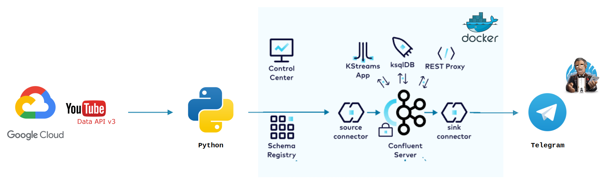

# Real-Time YouTube Analytics Streamed to Telegram

## Overview

An end-to-end data engineering pipeline that fetches real-time YouTube analytics and streams them through Kafka for processing with ksqlDB. The processed analytics data is then sent to Telegram for real-time notifications.

## System Architecture

<p align="center">


<p align="center">
    System Architecture
</p>

## Prerequisites

Before running this script, ensure you have the following installed:

- Python 3.10
- Docker, Docker Compose
- Youtube API (Google Cloud API)
- Kafka
- Confluent Containers (Zookeeper, Kafka, Schema Registry, Connect, ksqlDB, Control Center)
- Telegram Bot API (FatherBot)

## Getting Started

1. **Clone the repository**:

   ```bash
   git clone https://github.com/trannhatnguyen2/yotube-analytics-streams.git
   ```

2. **Install Python dependencies**:

   ```bash
   pip install -r requirements.txt
   ```

3. **Run Docker Compose**:

   ```bash
   docker compose -f docker-compose.yml up -d
   ```

   This command will download the necessary Docker images, create containers, and start the services in detached mode.

4. **Access the Services**

   - Kafka Control Center is accessible at `http://localhost:9021`.

## Configuration

1. Open `config/config.local.example`, delete characters `.example`, and set the following:

   - `YOUTUBE_API_KEY`: Your Youtube API Key in Google Cloud API
   - `PLAYLIST_ID`: The Youtube playlist ID you want to track

2. Set up your Kafka server address in the main script, by default, it's set to `localhost:9092`.

## How it works

1. **Fetches data from YouTube API using the given playlist ID**

   ```bash
   python main.py
   ```

2. **Create Stream to read and track data from Kafka topic using ksqlDB**

3. **Add Connector HttpSinkConnector**

4. **Send to Telegram Bot for real-time notifications**

---

<p>&copy; 2023 NhatNguyen</p>
